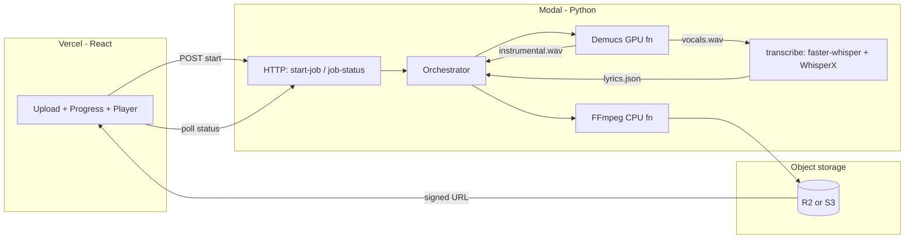

# Automated Karaoke Video Generator — Implementation Plan

**Stack:** Vercel (frontend) · Modal (backend/GPU) · Demucs (vocal separation) · faster-whisper (transcription) · WhisperX (forced alignment) · FFmpeg (MP4 + ASS karaoke burn-in)

**Principle:** Build and verify each layer in isolation before wiring the full pipeline. Integration only happens after each piece has a clear “done” definition and a local or scripted test.

---

## 1. What we are building

| Step | Input | Output |
|------|--------|--------|
| Upload | Audio file (mp3/wav/m4a) | Job ID + progress |
| Separate | Original audio | `vocals.wav` + `instrumental.wav` |
| Transcribe | **Isolated vocals** (not the full mix) | Rough word-level text + timestamps |
| Align | Vocals + transcript | Refined word timestamps (JSON) |
| Render | Instrumental + aligned lyrics | MP4 with karaoke-style highlighting |
| Deliver | MP4 | Signed download URL + in-browser preview |

**Transcription note:** faster-whisper already exposes word-level `start`/`end` — granularity is fine for karaoke. The hard part is **accuracy on sung audio** (pitch, melisma, production, residual bleed). Run transcription on Demucs’ **vocal stem**, not the original mix; then run **WhisperX** forced alignment (wav2vec2) on that stem to snap boundaries to the waveform (~±0.05s on clean vocals vs ~±0.1–0.3s from Whisper alone). Dense rap / heavy processing may still need manual fixes in v2.

**Pipeline order (v1):**

```text
original → Demucs → vocals.wav ──→ faster-whisper → WhisperX align → lyrics.json
                 └→ instrumental.wav ──────────────────────────────→ FFmpeg → MP4
```

**Target latency (optimized, GPU):** ~40–60s for a 3-minute song (Demucs is the bottleneck; transcribe + align are sequential after separation).

**Not in scope for v1:** Auth, payments, multi-user queues at scale. Add after the pipeline works end-to-end.

---

## 2. High-level architecture



**Why split deployments**

- **Vercel:** Static/SSR React only — no Python, no FFmpeg, no GPU.
- **Modal:** Serverless containers with optional `gpu="T4"` (or A10G later), `@modal.web_endpoint`, secrets, and `.spawn()` for parallel work.

**Async jobs (required):** Processing takes tens of seconds. Do not block a single browser request on the full pipeline.

1. `POST /start-job` → `{ job_id }` immediately  
2. Frontend polls `GET /job-status?job_id=...` every 2s  
3. On `status: "done"`, frontend receives `video_url` (signed)

---

## 3. Repository layout (target)

**Phase 0** creates the skeleton below (stubs + Vite scaffold). See [PHASE_0.md](./PHASE_0.md) for the exact tree, file minimums, and what is deferred. **Phases 1–7** fill in behavior without restructuring folders.

```
AutomaticKaraoke/
├── .gitignore
├── README.md
├── docs/
│   ├── IMPLEMENTATION_PLAN.md          # this file
│   ├── PHASE_0.md                      # Phase 0 runbook
│   ├── PHASE_1.md                      # Phase 1 runbook
│   ├── PHASE_2.md                      # Phase 2 runbook
│   ├── PHASE_3.md                      # Phase 3 runbook (Demucs)
│   ├── PHASE_4.md                      # Phase 4 runbook (Whisper + WhisperX)
│   ├── PHASE_5.md                      # Phase 5 runbook (FFmpeg + ASS)
│   └── PHASE_6.md                      # Phase 6 runbook (pipeline integration)
├── frontend/                           # Phase 0 scaffold → Phase 1 — Vercel
│   ├── .env.example                    # VITE_API_URL
│   ├── package.json
│   └── src/
│       ├── App.tsx                     # Phase 0: placeholder shell
│       ├── api/client.ts               # Phase 0: stub
│       ├── types/job.ts                # Phase 0: JobStatus + API types
│       └── components/                 # Phase 0: stubs → Phase 1: real UI
│           ├── UploadForm.tsx
│           ├── ProgressTracker.tsx
│           └── VideoPlayer.tsx
├── backend/                            # Phase 2: Modal API shell (FastAPI ASGI)
│   ├── .env.example
│   ├── requirements.txt                # modal + fastapi[standard]; ML deps Phase 3+
│   ├── web.py, orchestrator.py, jobs.py
│   ├── app.py
│   ├── jobs.py
│   ├── separate.py                     # Phase 3: Demucs
│   ├── transcribe.py                   # Phase 4: faster-whisper + WhisperX
│   ├── render.py                       # Phase 5: ASS + FFmpeg
│   └── storage.py                      # Phase 2+: R2 signed URLs
└── scripts/                            # Phase 0: stubs + READMEs
    ├── fixtures/                       # Phase 3: add sample_30s.mp3 locally
    ├── output/                         # gitignored artifacts
    ├── test_demucs_local.py            # Phase 3
    ├── test_whisper_local.py           # Phase 4 (input: vocals.wav)
    └── test_render_local.py            # Phase 5
```

**Added after Phase 0 (not in bootstrap):** `scripts/fixtures/sample_30s.mp3`, `scripts/fixtures/vocals_30s.wav`, `scripts/test_render_local.py`, in-browser mock API (Phase 1), Modal FastAPI + smoke scripts (Phase 2), `frontend/.env.modal`, `npm run smoke:modal` / `measure:start-job`.

---

## 4. Phased build plan (isolation first)

Each phase has **entry criteria**, **tasks**, **verification**, and **exit criteria**. Do not start the next phase until exit criteria pass.

### Phase 0 — Project bootstrap (2–4 hours)

**Detailed runbook:** [PHASE_0.md](./PHASE_0.md) — exact files/folders, file minimums, eight ordered steps, and the full completion checklist.

**Goal:** Git repo, folder skeleton, Vite + React + TypeScript scaffold with stub components and shared `JobStatus` types, Python/Modal stubs, and toolchain accounts — so Phase 1+ can start without reorganizing anything.

**Out of scope:** Real upload UI, Modal `web_endpoint`s, Demucs/Whisper/FFmpeg, R2 uploads, `pip install` of torch/demucs/whisperx, `sample_30s.mp3`, or a production backend on Vercel.

**Entry criteria:** Node 20+, Python 3.11/3.12, Git, editor installed. Optional accounts to create in Phase 0: Modal, Vercel, R2/S3 (keys wired in Phase 2+).

**Tasks (summary — see PHASE_0 for commands and gates):**

| Step | What you do |
|------|-------------|
| 1 | `git init`, root `.gitignore`, initial docs commit |
| 2 | `scripts/` + `backend/` skeleton (stub `.py`, READMEs, `fixtures/` + `output/`) |
| 3 | `npm create vite@latest frontend -- --template react-ts`; add `types/job.ts`, component stubs, `api/client.ts`, `.env.example`; verify `npm run dev` + `npm run build` |
| 4 | Python venv, `pip install modal`, `modal token new`, `modal profile current` |
| 5 | Root `README.md`, cross-link docs, commit scaffold |
| 6 | (Recommended) GitHub remote + push |
| 7 | (Recommended) Vercel project, root dir `frontend`, placeholder `VITE_API_URL`, preview deploy |
| 8 | README dev instructions; optional `.vscode/extensions.json` + Cursor rules; confirm `scripts/output/` gitignored — see [PHASE_0 § Cursor tooling](./PHASE_0.md#cursor-and-editor-tooling-optional) |

**Verification:** All boxes in [PHASE_0 completion checklist](./PHASE_0.md#phase-0-completion-checklist) — including `npm run build`, `modal profile current` (after `modal token new`), stub tree present, and explicit “not done” confirmations (no upload UI, no web endpoints, no ML installs).

**Exit criteria:** Phase 0 checklist fully checked; fresh clone runs `cd frontend && npm install && npm run dev`; Modal CLI authenticated; layout matches [PHASE_0 target tree](./PHASE_0.md#target-repository-tree); zero Phase 1–7 application logic.

**Optional (same phase, not exit criteria):** Cursor/VS Code extensions, Vercel MCP/plugin (after Vercel project exists), project rules — [Appendix D](#appendix-d--developer-tooling-cursor--editor).

**Status:** Complete (2026-05-22). Production frontend: https://automatic-karaoke.vercel.app. Retrospective pitfalls (dual branches, dual Vercel projects, manual OAuth): [PHASE_0 § Lessons learned](./PHASE_0.md#lessons-learned-phase-0-retrospective).

---

### Phase 1 — Frontend only (mock backend) ✓

**Detailed runbook:** [PHASE_1.md](./PHASE_1.md) — **complete** (May 2026).

**Entry criteria:** [Phase 0](./PHASE_0.md#exit-criteria--phase-1) complete (34/34); Vercel project **`automatic-karaoke`** only.

**Goal:** Upload UX, in-browser mock job progress (poll every 2s), sample video on `done` — zero real processing. **Done** — local + https://automatic-karaoke.vercel.app with `VITE_USE_MOCK=true`.

**Key decisions (see PHASE_1 for detail):**

| Topic | Choice |
|-------|--------|
| Mock | In-browser `src/mocks/mockJobApi.ts` when `VITE_USE_MOCK=true` |
| Vercel | Set `VITE_USE_MOCK=true` on Production + Preview — do not rely on `localhost` API URL |
| Sample video | `frontend/public/sample.mp4` (or stable HTTPS URL in mock) |
| API contract | Same `job.ts` types; Phase 2 swaps `client.ts` to real Modal `fetch` |

**Tasks (summary):** validation helper → mock API → client switch → polling hook → three components → App wiring → Vercel env + deploy → README.

**Exit:** [PHASE_1 checklist](./PHASE_1.md#phase-1-completion-checklist) complete; full flow on local + https://automatic-karaoke.vercel.app without GPU work.

---

### Phase 2 — Backend shell only (Modal, no ML) ✓

**Detailed runbook:** [PHASE_2.md](./PHASE_2.md) — **complete** (May 2026). Eight steps; retrospective: [§ What differed](./PHASE_2.md#what-differed-from-the-plan).

**Status:** Production https://automatic-karaoke.vercel.app uses Modal API (`VITE_USE_MOCK=false`). API: `https://jacoblum22--karaoke-api.modal.run`.

**Entry criteria:** [Phase 1](./PHASE_1.md#exit-criteria--phase-2) complete; Modal CLI authenticated; Vercel **`automatic-karaoke`** only.

**Goal:** Real HTTP endpoints and durable job lifecycle; pipeline steps are **stubs** that sleep and return a stable test `video_url` — **no** Demucs/Whisper/FFmpeg.

**Key decisions (as built):**

| Topic | Choice |
|-------|--------|
| HTTP | FastAPI in `backend/web.py`, `@modal.asgi_app(label="karaoke-api")` |
| Packaging | `_BACKEND_IMAGE` + `add_local_dir(backend)` for all Python modules |
| Job store | `modal.Dict` `karaoke-jobs` |
| Stub video | `https://automatic-karaoke.vercel.app/sample.mp4` |
| `start-job` | Spawn orchestrator async; HTTP waits for **full multipart upload** (not &lt;2s for large files) |
| Frontend UX | Optimistic progress on click; `npm run measure:start-job` for timing |
| Smoke | `scripts/smoke_*.py`, `npm run smoke:modal`, durability script defaults to production URL |

| Endpoint | Implementation |
|----------|----------------|
| `POST /start-job` | `create_job` + `spawn` stub; validate type/size; drain upload in chunks; return `{ job_id }` |
| `GET /job-status` | Read `modal.Dict` (`karaoke-jobs`); 404 if missing |
| Orchestrator stub | ~2s per stage; `video_url` = Vercel `sample.mp4` |

**Storage (Phase 2):** `modal.Dict` only. R2 and Volume artifacts deferred to Phase 6+.

**Tasks (summary):** `jobs.py` → `orchestrator.py` → `web.py` + ASGI → `modal deploy` → frontend env + optimistic UI → Vercel production env → smoke scripts + checklist.

**Exit:** [PHASE_2 checklist](./PHASE_2.md#phase-2-completion-checklist) complete; local + Vercel happy path without mock; no ML in `requirements.txt`.

---

### Phase 3 — Demucs in isolation ✓

**Detailed runbook:** [PHASE_3.md](./PHASE_3.md) — complete May 2026 (ear-test sign-off on Psychosomatic).

**Entry criteria:** [Phase 2](./PHASE_2.md#exit-criteria--phase-3) complete; `scripts/fixtures/sample_30s.mp3` available locally.

**Goal:** **vocals.wav** + **instrumental.wav** from mixed audio — local script and Modal GPU function — **no** orchestrator/frontend/R2 changes.

| Setting | Choice |
|---------|--------|
| Model | `htdemucs` |
| Stems | `vocals` + summed non-vocal stems (instrumental) |
| Output | 44.1 kHz WAV via stdlib `wave` (no torchcodec) |
| Modal | `_DEMUCS_IMAGE` on **T4** (separate from lean `_BACKEND_IMAGE`) |

**Delivered:** `separate.py`, `test_demucs_local.py`, `separate_stems` + smokes, Psychosomatic full-song validation (~315s CPU local / ~12s GPU Modal).

**Exit:** [PHASE_3 checklist](./PHASE_3.md#phase-3-completion-checklist) ✓; stub orchestrator unchanged.

---

### Phase 4 — Transcription + alignment in isolation ✓

**Detailed runbook:** [PHASE_4.md](./PHASE_4.md) — complete May 2026.

**Goal:** **`vocals.wav` only** → faster-whisper → WhisperX → **`lyrics.json`**. **Not** the full mix.

| Delivered | Notes |
|-----------|--------|
| `transcribe.py` | `transcribe_vocals`, `align_lyrics`, `transcribe_and_align` |
| Local CLI | `test_whisper_local.py`, `validate_lyrics_json.py` |
| Modal | `_WHISPER_IMAGE`, `transcribe_vocals_modal`, `smoke_whisper_fixture` |
| Outputs | `scripts/output/lyrics.json` (30s); `psychosomatic/lyrics.json` (full song, 342 words) |

**Runtime (reference):** local CPU ~163s / 30s clip; Modal T4 ~37s (30s or full song warm).

**Exit:** [PHASE_4 checklist](./PHASE_4.md#phase-4-completion-checklist) ✓; stub API unchanged.

---

### Phase 5 — FFmpeg + ASS render in isolation ✓

**Detailed runbook:** [PHASE_5.md](./PHASE_5.md) — `render.py`, ASS karaoke tags, local CLI, Modal `_RENDER_IMAGE` (CPU), eight steps.

**Entry criteria:** [Phase 4](./PHASE_4.md#exit-criteria--phase-5) exit; paired `lyrics.json` + `instrumental.wav` (Psychosomatic outputs recommended for QA).

**Goal:** **Precomputed** `lyrics.json` + **`instrumental.wav`** → **`karaoke.mp4`** with word-by-word highlight. No Demucs/Whisper in this step.

| Delivered | Notes |
|-----------|--------|
| `render.py` | `lyrics_to_ass`, `render_karaoke`, `filter_lyrics_to_clip` |
| Local CLI | `test_render_local.py` (`--no-clip`, `--validate`) |
| Smokes | `smoke_phase5_step1`–`step6`, `smoke_render_modal.py` |
| Modal | `_RENDER_IMAGE`, `render_karaoke_modal`, `smoke_render_fixture` |
| Outputs | `scripts/output/karaoke.mp4` (30s); `psychosomatic/karaoke.mp4` (~194s) |

**Runtime (reference):** local CPU ~10s / 30s clip, ~30–55s full song; Modal CPU ~4s warm / 30s clip.

**Exit:** [PHASE_5 checklist](./PHASE_5.md#phase-5-completion-checklist) ✓; stub API unchanged.

---

### Phase 6 — Integrate ML into backend ✓

**Detailed runbook:** [PHASE_6.md](./PHASE_6.md) — Volume per job, real orchestrator, R2 `video_url`, E2E API smoke.

**Status:** Complete — production uses `run_real_pipeline` on Modal (T4 GPU), R2 delivery, Vercel frontend with `VITE_USE_MOCK=false`.

**Entry criteria:** [Phase 5](./PHASE_5.md#exit-criteria--phase-7) exit; R2 bucket + Modal secret ready.

Wire real functions into the orchestrator from Phase 2:

```text
start-job
  → separate(audio) → vocals.wav, instrumental.wav
  → transcribe(vocals) → faster-whisper (large-v3, vad off) → WhisperX align → lyrics.json
  → render(instrumental, lyrics)
  → upload MP4 → R2 public URL
  → status = done
```

| Concern | Approach |
|---------|----------|
| Ordering | Demucs **before** transcribe; alignment needs vocal stem + transcript |
| Temp files | Modal Volume at `/jobs/{job_id}/` |
| Failures | Set `failed` + `error`; smoke tests clean R2 + Volume |
| Delivery | R2 `video_url`; frontend `<video src>` |

**Verification checklist**

- [x] One real song completes via API only (curl or frontend)
- [ ] Total time &lt; 90s on T4 for 3-min song (153s cold logged; Phase 7 `keep_warm`)
- [x] Failed pipeline does not leave orphan “done” status

**Exit:** [PHASE_6 checklist](./PHASE_6.md#phase-6-completion-checklist); `POST /start-job` returns real karaoke MP4 URL.

---

### Phase 7 — Production hardening

| Area | Actions |
|------|---------|
| Performance | `keep_warm=1` on GPU functions; consider A10G if needed |
| Upload | Presigned POST to R2 instead of base64 (size/latency) |
| Security | Rate limit, max duration (e.g. 8 min), auth optional |
| Observability | Structured logs per job_id; Modal dashboards |
| Cost | Log GPU seconds per job |

---

## 5. Modal design notes

### Images (split for faster cold starts)

| Image | Contents |
|-------|----------|
| `whisper_image` | faster-whisper, whisperx, wav2vec2, CUDA libs |
| `demucs_image` | demucs, torch, CUDA |
| `render_image` | ffmpeg, ass generation (no GPU) |

Heavy deps should not all live in one giant image unless necessary.

### Secrets (`modal.Secret`)

- `R2_ACCESS_KEY`, `R2_SECRET_KEY`, `R2_BUCKET`, `R2_ENDPOINT`
- Optional: `HF_TOKEN` if pulling gated models

### GPU sizing

| Workload | GPU | Notes |
|----------|-----|-------|
| Demucs `htdemucs` | T4 | ~20–40s per song |
| faster-whisper + WhisperX | T4 | ~5–15s on vocal stem after Demucs |
| FFmpeg | CPU only | Cheap, 10–30s |

### Job state

Use `modal.Dict.from_name("karaoke-jobs", create_if_missing=True)`:

```python
# job_id -> { status, progress, video_url, error, created_at }
```

TTL cleanup: delete entries older than 24h (cron function or on-read).

---

## 6. Frontend ↔ backend integration

| Variable | Where | Purpose |
|----------|-------|---------|
| `VITE_API_URL` | Vercel | Modal web endpoint base |
| CORS | Modal | Allow `https://*.vercel.app` and production domain |

**Deploy commands (when ready):**

```bash
cd backend && modal deploy app.py
cd frontend && vercel --prod
```

---

## 7. Karaoke subtitle strategy (FFmpeg + ASS)

1. Convert aligned `words[]` (post-WhisperX) → ASS dialogue lines with karaoke tags (`{\kXX}` centiseconds per syllable/word).
2. Style: bottom-center, large font, outline, inactive = white, active = yellow (example).
3. Burn subtitles: `ffmpeg -i instrumental.mp4 -vf "ass=subtitles.ass" out.mp4`

Keep `render.py` pure: input JSON + audio path → output MP4 path. Unit-test ASS generation without FFmpeg using snapshot tests on the `.ass` file.

---

## 8. Testing matrix

| Layer | Local test | Modal test | Integrated |
|-------|------------|------------|------------|
| Frontend | `npm test` / manual | Vercel preview + mock API | Real API |
| Job API | — | curl start/status | Frontend poll |
| Demucs | `scripts/test_demucs_local.py` | `modal run separate.py` | Orchestrator |
| Transcribe + align | `scripts/test_whisper_local.py` (on `vocals.wav`) | `modal run transcribe.py` | Orchestrator |
| Render | `scripts/test_render_local.py` | `modal run render.py` | Orchestrator |
| Full | — | — | One song E2E |

**Fixture discipline:** Keep `sample_30s.mp3` for CI-speed loops; use one full song manually before demos.

---

## 9. Risks and mitigations

| Risk | Mitigation |
|------|------------|
| Whisper timing off on sung lyrics | Transcribe on **vocal stem** + WhisperX align; v2 = manual offset / lyric editor |
| Wrong lyrics (ASR) | User-visible transcript in v2; v1 accepts occasional mis-hears on hard songs |
| Browser timeout | Async job + poll only |
| Modal cold start + 1GB Demucs load | `keep_warm=1`; split images; htdemucs not ft |
| Large uploads on Vercel | Cap file size; move to R2 presigned upload |
| GPU preemption | Short jobs (&lt;2 min); retry once on failure |
| Copyright / abuse | ToS + rate limits; no public anonymous high limits |
| OneDrive sync on dev folder | Locked/slow `node_modules` or `.venv`; pause sync or move repo — [PHASE_0 troubleshooting](./PHASE_0.md#troubleshooting-common-on-windows) |

---

## 10. Suggested timeline

| Phase | Effort |
|-------|--------|
| 0 Bootstrap | 2–4 hours (done) |
| 1 Frontend mock | 4–8 hours (see [PHASE_1.md](./PHASE_1.md)) |
| 2 Backend shell | 1 day |
| 3 Demucs isolate | 1–2 days |
| 4 Transcribe + WhisperX isolate | 1–2 days |
| 5 Render isolate | 1–2 days |
| 6 Integrate | 1–2 days |
| 7 Harden | 2–3 days |

**Working demo (phases 0–6):** ~1–1.5 weeks focused. **Polished product:** +1 week.

---

## 11. Decision log (locked for v1)

| Decision | Choice | Rationale |
|----------|--------|-----------|
| Vocal separation | Demucs `htdemucs` | Quality; maintained; fine on GPU |
| Transcription | faster-whisper on **vocal stem** | Word-level text; 4× faster than stock Whisper |
| Alignment | WhisperX (wav2vec2) | Snaps word boundaries to waveform; karaoke-grade timing |
| Video | FFmpeg + ASS burn-in | Robust karaoke highlighting |
| Frontend host | Vercel | DX, previews, env vars |
| Backend host | Modal | GPU serverless, Python-native |
| Async pattern | start + poll | Simple, debuggable (per PDF) |
| Pipeline order | Demucs → transcribe+align → render | Transcription must not run on full mix |

---

## 12. Next actions (ordered)

0. ~~**Complete Phase 0**~~ ✓ — see [PHASE_0 retrospective](./PHASE_0.md#lessons-learned-phase-0-retrospective).  
1. ~~**Complete Phase 1**~~ ✓ — [PHASE_1.md](./PHASE_1.md) (mock UI + `VITE_USE_MOCK` on Vercel Production).  
2. ~~Deploy frontend preview~~ ✓ — https://automatic-karaoke.vercel.app  
3. ~~**Add real Modal `start-job` / `job-status` + Dict job store (Phase 2)**~~ ✓ — [PHASE_2.md](./PHASE_2.md).  
4. ~~**Phase 3 — Demucs in isolation**~~ ✓ — [PHASE_3.md](./PHASE_3.md) (Psychosomatic ear-test signed off May 2026).  
5. ~~**Phase 4 — Transcription + alignment**~~ ✓ — [PHASE_4.md](./PHASE_4.md).  
6. ~~**Phase 5 — FFmpeg + ASS render**~~ ✓ — [PHASE_5.md](./PHASE_5.md) (Psychosomatic `karaoke.mp4` signed off May 2026).  
7. **Phase 6 — Integrate ML into backend** — [PHASE_6.md](./PHASE_6.md).

---

## Appendix A — Example transcribe + align isolation snippet

```python
# Input: vocals.wav (from Demucs), not the original mix
from faster_whisper import WhisperModel
import whisperx

model = WhisperModel("medium", device="cuda", compute_type="float16")
segments, _ = model.transcribe("vocals.wav", word_timestamps=True, vad_filter=False)

# Build segment list for WhisperX (see whisperx docs for exact segment shape)
audio = whisperx.load_audio("vocals.wav")
align_model, metadata = whisperx.load_align_model(language_code="en", device="cuda")
result = whisperx.align(segments, align_model, metadata, audio, device="cuda")
# result["word_segments"] or per-segment words → lyrics.json
```

## Appendix B — Example Demucs isolation snippet

```python
# Prefer official demucs CLI or API demucs.separate
# python -m demucs.separate -n htdemucs --two-stems=vocals -o out/ audio.mp3
# → out/htdemucs/audio/vocals.wav  (for faster-whisper + WhisperX)
# → out/htdemucs/audio/no_vocals.wav  (instrumental for FFmpeg)
```

## Appendix C — Environment variables checklist

**Vercel**

- `VITE_API_URL` — Modal web base (no trailing slash); required when `VITE_USE_MOCK=false`
- `VITE_USE_MOCK` — `false` in production (Phase 2+); `true` for Phase 1-only mock

**Modal secrets**

- R2/S3 credentials  
- (Optional) custom domain for CORS allowlist stored as env on web endpoint

## Appendix D — Developer tooling (Cursor / editor)

Optional setup documented in detail in [PHASE_0.md § Cursor and editor tooling](./PHASE_0.md#cursor-and-editor-tooling-optional). Summary:

| Category | Recommendation | Priority |
|----------|----------------|----------|
| **Must finish first** | Modal CLI (`modal token new`), Vercel project (root `frontend/`), GitHub remote | Phase 0 Steps 4–7 |
| **VS Code extensions** | ESLint, Python, Pylance; Ruff optional; REST Client/Thunder Client in Phase 2+ | Step 8 — optional |
| **Vercel MCP / plugin** | Deploy/env troubleshooting; moderate value for **Vite** (much plugin content is Next.js-specific) | After Step 7 — optional |
| **Cursor rules** | `.cursor/rules` or `AGENTS.md` — stack, async API, vocal-stem-only transcription | Step 8 — optional |
| **Modal agent context** | `modal.com/llms-full.txt`, [developing with LLMs](https://modal.com/docs/guide/developing-with-llms) when editing `backend/` | Any phase |
| **System CLIs** | `vercel` CLI (Step 7+), `gh` (Step 6+), FFmpeg on PATH (Phase 5), CUDA optional (local ML only) | Per phase |
| **Defer** | Next.js/AI SDK plugins, Modal Jupyter extension, R2 IDE plugins, Demucs/Whisper IDE plugins | Low fit for v1 |

**Stack reminder:** Vercel hosts **static Vite + React** only; **Modal** runs all Python, GPU, and FFmpeg orchestration. Do not expect Vercel marketplace plugins to help with Demucs, Whisper, or Modal deploys.

---

*Document version: 2.3 — adds [PHASE_6.md](./PHASE_6.md) pipeline integration runbook.*
